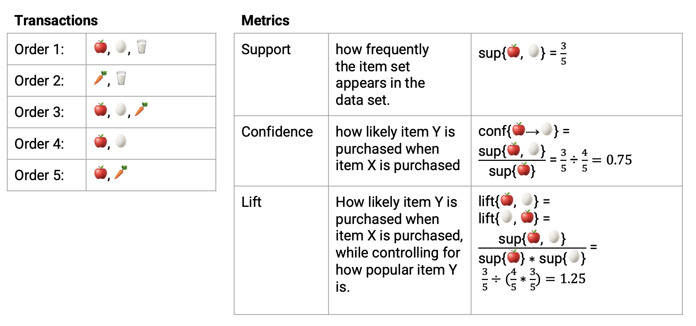

# Market Basket Analysis

## 1. Apriori
**Market Basket Analysis**  is a technique that identifies the strength of association between pairs of products purchased together and 
identifies patterns of co-occurrence. A co-occurrence is when two or more things take place together.

**Association Rules** are intended to identify strong rules discovered in transaction data using measures of 
interestingness. The outcome of this type of technique is, in simple terms, a set of rules that can be understood 
as “if this, then that”.

## 2. Metrics
Suppose we have transactions below:

**Support:**
- An indication of how frequently the item set appears in the data set.
  In Table 1 below, the support of `{🍎, 🥚}` is 3/5 transactions.

**Confidence:**
- How likely item Y is purchased when item X is purchased. In the example above, the
  confidence of `{🍎→🥚}` is 75%. One drawback of the confidence measure is that it might misrepresent the 
importance of an association. Confidence only accounts for how popular 🍎 are, but not 🥚. If 🥚 are also very popular 
in general, there will be a higher chance that a transaction containing 🍎 will also contain 🥚.

**Lift:**
- How likely item Y is purchased when item X is purchased, while controlling for how popular item Y is. 
In the example above, Lift of `{🍎→🥚}` is 1.25: 
  - Lift > 1 means that item Y is **likely** to be bought if item X is bought, 
  - Lift < 1 means that item Y is **unlikely** to be bought if item X is bought.
  - Lift = 1 implies no relationship between X and Y (X and Y occur together only by chance).

- One way to understand lift is to think of the denominator as the likelihood that A and B will appear in the 
same order if there was no relationship between them. In the example above, if 🍎 occurred in 80% of the orders 
and 🥚 occurred in 60% of the orders, then if there was no relationship between them, we would expect both of 
them to show up together in the same order 48% of the time (80% * 60%). The numerator, on the other hand, 
represents how often 🍎 and 🥚 actually appear together in the same order. In this example, that is 60% of 
the time. Taking the numerator and dividing it by the denominator, we get to how many more times 🍎 and 🥚 
actually appear in the same order, compared to if there was no relationship between them (ie: that they are occurring 
together simply at random).

## 3. Implementation
### 3.1 Data
The Instacart Online Grocery Shopping Dataset from [Kaggle](https://www.kaggle.com/competitions/instacart-market-basket-analysis/data).

### 3.2 Metric Threshold
The first step in order to create a set of association rules is to determine the optimal thresholds for 
support and confidence. If we set these values too low, then the algorithm will take longer to execute and we 
will get a lot of rules (most of them will not be useful). Then, what values do we choose? We can try 
different values of support and confidence and see graphically how many rules are generated for each combination.

- Support level of 10%. We only identify a few rules with very low confidence levels. This means that there 
are no relatively frequent associations in our data set. We can’t choose this value, the resulting 
rules are unrepresentative.
- Support level of 5%. We only identify a rule with a confidence of at least 50%. It seems that we have to 
look for support levels below 5% to obtain a greater number of rules with a reasonable confidence.
- Support level of 1%. We started to get dozens of rules, of which 13 have a confidence of at least 50%.
- Support level of 0.5%. Too many rules to analyze!

# References:
1. [Association Rules Mining/Market Basket Analysis](https://www.kaggle.com/code/datatheque/association-rules-mining-market-basket-analysis)
2. [Captum · Model Interpretability for PyTorch](https://captum.ai/tutorials/)
