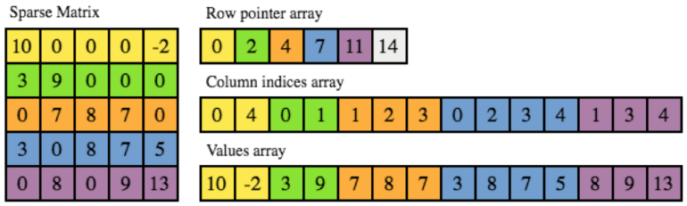
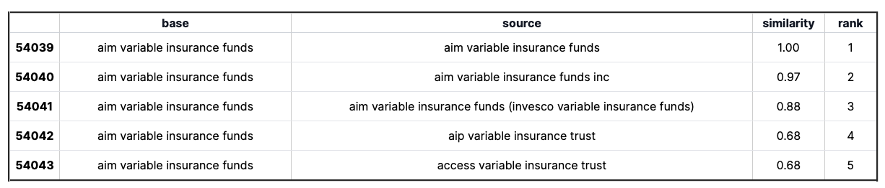

# Fast String Matching
Data in the real world is messy. Dealing with messy data sets is painful and burns through time which could be 
spent analysing the data itself.

This post focuses in on "fuzzy" matching and how this can help to automate significant challenges in 
a large number of data science workflows through:
- Deduplication: Finding similar names in a data set 
(Ex: we need to combine **D J Trump**, **D. Trump** and **Donald Trump** into the same entity).

For the human reader it is obvious that both **D J Trump** and **Donald Trump** are the same name. However for 
a computer these are completely different making spotting these nearly identical strings difficult.

Some examples about product name:
```text
- Giày Thể Thao Nike Zoom 2k Thời Trang vs. Giày Thể Thao Nike Thời Trang
- iPhone 13 Pro Max 128GB vs. iPhone 13 Pro Max 128 | 256 GB
- Áo Len Tay Dài Cổ Lọ vs. Áo Len Nữ Tay Dài Cổ Lọ Thời Trang
- Thú Nhồi Bông Hình Chú Ngựa Xinh Xắn Đáng Yêu vs. Thú nhồi bông hình chú ngựa con đáng yêu
- Shopee vs. Shopeeee vs. Shoppee
```
---

# 1.The Algorithm
## 1.1 TF-IDF
It is a simple algorithm which splits text into "chunks" (ngrams), counts the occurrence 
of each chunk for a given sample and then applies a weighting to this based on how rare the chunk is across 
all the samples of a data set. This means that useful words are filtered from the ‘noise’ of more common 
words which occur within text.

Consider a document containing 100 words in which the word ‘cat’ appears 3 times. 
The term frequency for ‘cat’ is then (3 / 100) = 0.03. Now, assume we have 10 million documents 
and the word ‘cat’ appears in one thousand of these. Then, the inverse document 
frequency  is calculated as log(10,000,000 / 1,000) = 4. Thus, the TF-IDF weight is the product of 
these quantities: 0.03 * 4 = 0.12.

## 1.2 N-gram
In our case using words as terms wouldn’t help us much, as most company names only contain one or two words. 
We will use n-grams: sequences of N contiguous characters.
```text
All 3-grams in "iPhone 13 Pro":
['iPh', 'Pho', 'hon', 'one', 'ne ', 'e 1', ' 13', '13 ', '3 P', ' Pr', 'Pro']
```

It is noted that a very sparse matrix is generated after the vectorization. The feature space is 16 million 
(the vocabulary size of the vectorizer is 2²⁴). On average, one company name contains around 4~5 words. 
However, there is no native sparse matrix multiplication operation (strictly speaking, we are talking about 
sparse matrix times sparse matrix) in Spark v2.0 directly. Converting the matrices to dense matrices is 
not memory efficient.

## 1.3 Compressed sparse row (CSR)
There are several formats to store a sparse matrix, such as Dictionary of Key (DOK), 
List of lists (LIL), Coordinate list (COO), Compressed sparse row (CSR) and 
Compressed sparse column (CSC). Because CSR allows fast access and matrix multiplication, it is used in 
SciPy Sparse matrix dot function:



# 2. Experiment with dataset
I just grabbed a random dataset with lots of company names from [Kaggle](https://www.kaggle.com/datasets/dattapiy/sec-edgar-companies-list).
Let's run the experiment. 

Using wrapper is also as simple as few lines of code, you can refer the code in [the link](https://github.com/kevinkhang2909/ML-learning-journey/blob/main/nlp/string_matching/string_matching.ipynb).
```python
item = df['company_edit_name'].unique().tolist()
match_df = TextMatch(item, item).run_match()
match_df
```
The matches look pretty similar! The cosine similarity gives a good indication of the similarity among item names.



# References:
1. Boosting Selection Of Most Similar Entities In Large Scale Datasets. Sun Analytics. [www.sun-analytics.nl](https://www.sun-analytics.nl/posts/2017-07-26-boosting-selection-of-most-similar-entities-in-large-scale-datasets/)
2. Sparse_dot_topn. Ing Bank. [https://github.com/ing-bank](https://github.com/ing-bank/sparse_dot_topn)