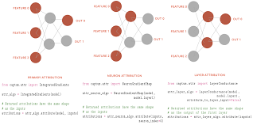
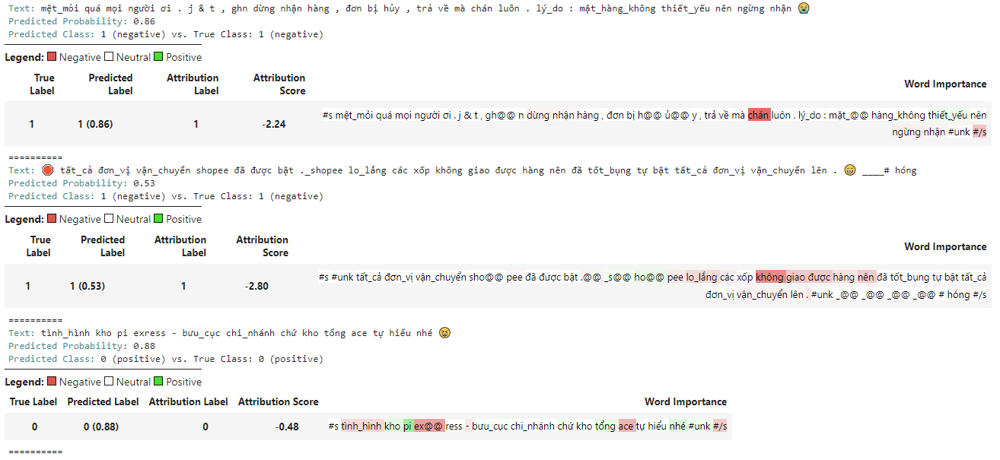
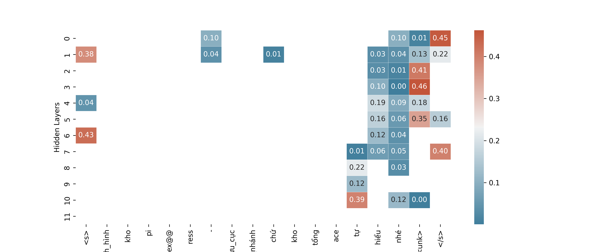

# Captum
Considering that most business people won't have an intuitive understanding of the Deep Learning 
pipeline and therefore won't understand your accuracy metrics or loss functions, you need 
another way to show them your model's performance.

Captum is a package developed by Meta engineers, encapsulating dozens of widely accepted 
interpretation techniques. In this post, I’ll offer you a walking example built around the Hugginface 
sentiment classifier and demonstrate a bit about Captum, how it is implemented and 
you can intuitively understand the ideas.
---

# 1. Captum
## 1.1 Attributions
Captum’s approach to model interpretability is in terms of attributions. 
The attribution algorithms in Captum can be grouped into three main categories: primary, neuron and layer attributions.

- Primary attribution algorithms are the traditional feature importance algorithms
that allow us to attribute output predictions to model inputs.
- Layer attribution variants allow us to attribute output predictions to all neurons in a hidden layer.
- Neuron attribution methods allow us to attribute an internal, hidden neuron
to the inputs of the model.[1]



## 1.2 Steps to go
1. Generate tokenize input and predicted class.
2. Calculate a set of gradients to measure changes with each step, where a step is a process of introducing more and more information.
3. Normalize gradients by dividing each step vector by its sum over steps. 

# 2. Implementation Layer Attribution
## 2.1 Crawling Data
Let's take a look at some Vietnamese comments crawling on Facebook. This is a common classification problem in business.
We need to do a sentiment analysis where label 0 is postitive comments and  1 is negative comments.
To disscuss about Captum, let's skip fine-tunning model part (or you can check via [Github](https://github.com/kevinkhang2909/ML-learning-journey/blob/main/nlp/transformers_learning/sentiment_phobert.ipynb).
I used PhoBERT pretrain) and step to interpretation part.

Let's go with data. The data is already converted to tokens by Underthesea.


## 2.2 Captum Wrapper
There are two different ways of computing the attributions for embedding layers. 
1. Use LayerIntegratedGradients and compute the attributions with respect to BertEmbedding. 
2. Use LayerIntegratedGradients for each word_embeddings and compute the attributions each embedding.

Attribution score definition:
The attribution scores indicate how much a self-attention edge attributes to the final model decision. [2]

```python
def custom_forward(self, inputs):
    return torch.sigmoid(self.model(inputs)[0])[0]  # binary

lig = LayerIntegratedGradients(custom_forward, model.roberta.embeddings)
attributions, delta = lig.attribute(inputs=input_ids,
                                    baselines=ref_input_ids,
                                    n_steps=500,
                                    internal_batch_size=3,
                                    return_convergence_delta=True)
```

Summarize attributions:
```python
attributions = attributions.sum(dim=-1).squeeze()
attributions_sum = attributions / torch.norm(attributions)
```

1st method is wrapped in simple, few lines of code, you can refer [the code here](https://github.com/kevinkhang2909/ML-learning-journey/blob/main/nlp/transformers_learning/captum_visual.ipynb).
Let's compute attributions with respect to the BertEmbeddings layer.

```python
explain = XAI(text, label, tokenizer, model, device)
explain.visualize()
```
Visualizing salient tokens computed by integrated gradients that contribute to the predicted class using a binary classification model.



From the results above we can see which tokens model is focusing.

With common sense, we can understand some words such as 'chán', 'không giao được hàng' may containt negative feedbacks which the model can detect.

## 2.3 LayerConductance - Hidden Layers
Furthermore, we can explore a little bit about the distribution of attribution scores for each token across all layers 
in PhoBERT model by Layer Conductance.

PhoBERT has total 12 hidden layers. Let's iterate over all layers and compute the attributions for all tokens.
- Word_embeddings is a matrix of shape (64001, 768) where the first dimension is the vocabulary dimension, 
while the second is embedding dimension, i.e. the number of features with which we represent a word. For base-bert 
it's 768 and it increases for bigger models. In general the higher the embedding dimension the better we can represent 
certain words-this is true to a degree, at some point increasing the dimension will not increase the accuracy of the 
model by much while computational complexity does.

- Position_embeddings is a matrix of shape (256, 768) where the former represents the max sentence length whilst the 
latter is the features dimension as for word embeddings-so depending on the position of each token we retrieve 
the associated vector.

- Token_type_embeddings is "redundant" here and comes from the Bert training task where the semantic similarity between 
two sentences is assessed-this embedding is needed to distinguish between the first and the second sentence. We do 
not need it as we have only one input sentence for classification task.]

```python
print(model.roberta.config.num_hidden_layers)
# output: 12
```

```python
def forward_func2(inputs):
    return model(inputs_embeds=inputs)[0].max(1).values

lc = LayerConductance(forward_func2, model.roberta.encoder.layer[i])
lc_vals = lc.attribute(input_embeddings)
```



The plot above represents a heat map of attributions across all layers and tokens. Some unknown-token gains 
increasingly high attribution on layer 6. However, in the rest layers that importance is diminishing.

# References:
[1] Captum: A unified and generic model interpretability library for PyTorch. [https://arxiv.org/pdf/2009.07896.pdf](https://arxiv.org/pdf/2009.07896.pdf) (accessed Jan 03, 2023)

[2] Self-Attention Attribution: Interpreting Information Interactions Inside Transformers. [https://arxiv.org/pdf/2004.11207.pdf](https://arxiv.org/pdf/2004.11207.pdf) (accessed Jan 03, 2023)

[3] Captum Official. captum.ai. [https://captum.ai/tutorials/](https://captum.ai/tutorials/) (accessed Jan 03, 2023)
