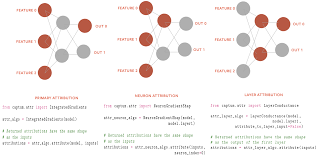
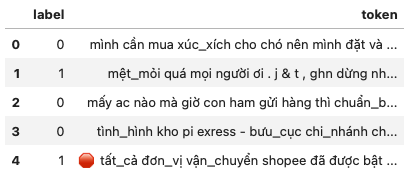

# Captum
Considering that most business people won't have an intuitive understanding of the Deep Learning 
pipeline and therefore won't understand your fancy accuracy metrics or loss functions, you need 
another way to show them your model's performance.

Captum is a package developed by Meta (Facebook) engineers, encapsulating dozens of widely accepted 
interpretation techniques. In this post, I’ll offer you a walking example built around the Hugginface 
sentiment classifier. In this part, I will demonstrate a bit about Captum, how it is implemented and 
you can intuitively understand the ideas.
---

# 1. Captum
## 1.1 Attributions
Captum’s approach to model interpretability is in terms of attributions. 
The attribution algorithms in Captum can be grouped into three main categories: primary, neuron and layer attributions. [1]

- Primary attribution algorithms are the traditional feature importance algorithms
that allow us to attribute output predictions to model inputs.
- Layer attribution variants allow us to attribute output predictions to all neurons in a hidden layer.
- Neuron attribution methods allow us to attribute an internal, hidden neuron
to the inputs of the model. 



## 1.2 The Algorithm
1. Generate tokenize input and predicted class.
2. Calculate a set of gradients to measure changes with each step, where a step is a process of introducing more and more information.
3. Normalize gradients by dividing each step vector by its sum over steps. 

# 2. Implementation
## 2.1 Crawling Data
Let's take a look at some Vietnamese comments crawling on Facebook. The comments have already preprocessed to put into PhoBERT



## 2.2 Captum Wrapper
Using wrapper is also as simple as few lines of code:

```python
text = df['token'].values[i]
label = df['label'].values[i]
explain = XAI(text, label, tokenizer, model, device)
explain.construct_input_ref_pair()
explain.process()
```

Visualizing salient tokens computed by integrated gradients that contribute to the predicted class using a binary classification model.


# References:
[2009.07896.pdf (arxiv.org)](https://arxiv.org/pdf/2009.07896.pdf)
[Captum · Model Interpretability for PyTorch](https://captum.ai/tutorials/)
